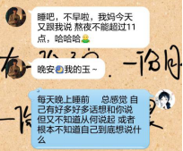

……

我早就说过了，我已经想过了，是我自己的问题，我改了就好了。

你非要反思，其实我也知道，你根本不知道自己咋了，又该从何“反思”起呢？

所以你写的“反思”，我就没有想打开看

结果你说等你睡醒还要写V2，我都觉得，你真辛苦，我真的真的很抱歉让你这么辛苦

 

你歇歇吧

你觉得我在生气吗？那你觉得我为什么生气呢？因为我说，不说晚安，你非要说晚安？

还有什么呢，“其他的不开心还是什么什么初衷”？？？？？？？？？

 

唉，我都说过了，我反思，你反思根本没有用

 

你知道为什么我会立一个flag说，“从今以后，我们两个人之中，我一定做先睡的那个”吗？

 

如果你翻一翻记录会发现，是因为前一天晚上看完电影挂了电话，我去洗漱了，然后回来拿起手机，是你发来一条“晚安，我早点睡了”

我当时想了好几分钟，你的这条消息，我该回什么呢？

最后我回了

好的

晚安

 

因为比起“你收拾好了吗上床了吗这会儿想睡吗还想干点什么吗你还有什么想和我说的吗我已经收拾好在等你啦以及我睡前也想要你的晚安”等等信息

你的这条消息

更像一条关门通知，传递的信息只不过是：“我睡了你自便你可以给我发消息也可以不发总之我不会回”

所以我回的那句晚安，和“收到”也没有什么区别。

那么其实，回和不回，也没有什么区别

 

所以第二天我说我要立这个flag

“我一定要做我们两个人之中早睡的那一个”

其实是“我一定不要做两个人之中收到“通知”的那一个”

因为每晚都要被告知“关门”，我在门口看着关门通知，举起不知道敲还是不敲的手，真是不知道如何安放

 

所以我立了flag

 

第二天下午呢，就像我说的，本来想和你一起看电影的，然后又是因为一条消息，然后就没有和你看

既然你要看电影，我可有可无，不是必需品，我又为什么要在场呢

我知道，你是想说因为知道我看一部电影需要的缓冲时间比较长，所以你猜我不看

可是看《流感》那天其实也是啊，而且还是早上说好一起看的.然后你不也是先看了吗？如果不是因为你看到两分钟的时候给我发消息说“克服恐惧最好办法的就是直面恐惧，我在看《流感》了”，可能等我知道的时候你又看完了

我也不知道你可能是忘了还是觉得等不及了，总之张玉也确实是不会影响到你的进程——无论是看电影还是睡觉

 

然后呢……

昨天晚上是怎么了呢……

电话末你说好啦你早点睡晚安了，说完就准备挂电话了

然后我当时听了，停顿了一两秒，没忍住，我就说，我们能不能以后约定我先和你说晚安（同上啊，我不想每晚都被通知），然后你再和我回晚安

你说，可以啊

然后  一两秒钟，我正在想我还有没有什么要和你说的话

你说：“那你倒是说啊”

我当时真的……

原来我这么说了以后，在你看来问题也不大，不就是催我先说，然后才能轮到你说，然后说了就能挂电话了吗？

——那我们直接挂了它不香吗？

 

那我们到底为什么要说这个晚安？

到底有什么意义？

我每天接受你的睡觉通知到底有什么意思

 

我当时真的气的眼泪都出来了，我也没忍住，直接说你气死我了

结果你说

“明天再讨论这个问题吧 晚安”

啪-又是一张关门通知贴我脸上了

那这次你来说

我看到你这句晚安，我又应该怎么回呢？

 

好，于是我就没回

那怎样，你关门了我总不能自己把自己气死

我就反思啊

 

首先，人应该早睡，早睡没有错

其次，人应该有自己的安排，有自己的安排没有错

……反思着反思着

我就从生气变成了羡慕你

我刷微博，看到贴子标题是“情侣相处的时候女生应该怎么做”

有什么呢，不要秒回消息，不要黏人……不要显得你好像永远都在这里

还有一些鸡汤比如“喜欢一个人不可以喜欢的太满，就像对方口渴，你给他一口水喝就会觉得很甜很甜，如果给他一碗水，可能就没感觉了”

“大家都说三分爱人，七分爱己，但我总是忘记，常常给别人七分爱意和甜蜜，留给自己三分小心翼翼真的要和自己说声对不起，对不起我太喜欢那个人了以至于总是忽略了我自己”

 

真的就像你说的，你也感觉到了，有很多事我怕你介意，所以我总是很小心地同你讲，很小心地问你，我并不感觉累，相反如果答案是我没有让你感觉到不舒服 我就会很开心，你说你做梦梦见我要和你分手，我就在想是不是我让你很没有安全感，我也一直在想怎么样才让你有安全感，我也不知道我所做的一切到底够不够证明我的真心呢？然后最后我就真的忘了，忘了我自己根本就还是一个缺乏安全感的人啊！

 

我总是问你，你喜欢我什么，你说你喜欢我会画画，写字好看，漂亮，可爱

我说如果我不会画画，字也不好看，唱歌也跑调，也丑也不可爱呢

我问你喜欢长发还是短发，你说长发，我说那我就要去剪短

我问你喜欢哪个女主，你说三姐可爱，我说那我就一定不走可爱路线

……你有没有想过我为什么总是这么说，真的是在抬杠吗还是只是玩笑？

不是，是因为我一直在试探，如果你会离开我，会是因为我不可爱呢还是会因为我变了短发？

或者你一直说我好看，那有一天我不好看了，你就走了吗

你也会说让我少吃点，不然一百二了，我总是说，是我们家喂的我，又不是你，是啊我就在想你的意思是一百二就怎样呢？有一天马康哲一百八了我该和他分手还是怎么样呢？说到这里我真的不得不说，我从不避讳说我从小到大从来也不是一个苗条漂亮的女孩子，而我的前任也确实从来没有把我胖不胖挂在嘴上啊？到底是怎样，我张玉这个人到底是为什么会被你喜欢，有朝一日又到底会因为什么被你嫌弃呢？

 

总之我昨晚反思了很久，只要我陷入感情，就会不停地向对方靠近，基本上是有求必应的那种，总之“恋爱中女生不要做的几件事”我条条都中

是啊，我很羡慕你，我今天一天都在想，我应该有自己的安排自己的事，不会因为你而打断的事

——就像你那未诞生的V2，也最起码得等到你午睡睡醒了再写吧——反思这种事，道歉这种事，女朋友不开心这种事，也总得等午睡睡醒吧

 

是啊………………………………

就像我说的，我这么多年都没有长进，不管是友情还是失败的爱情，总是用了百分之一百二的力气去爱别人，总是拿出你要通宵我就陪你到天明，你要上刀山我也一起啊的态度

 

——包括有一天，好像是除夕，一点你说今晚不想睡想打游戏，我说好啊我陪你

虽然最后我很困很困，但是那天我很开心，因为那天是你看着我先睡着

 

也包括我说，我印象中有一次九点多，你说“我要去看个电影了，你早点睡吧”所以我从此记得可能你不喜欢看电影被打扰

后来我发现，原来你如果准备睡觉，也不能打扰

 

对了，关于你说的那个，我的原话是

 

——是啊，就连我的这段话也是在你晚安通知之后才吐出来了

 

可能不光看电影、睡觉不会等我，你的其他安排应该也不会等我，也不想被打扰吧。

 

我今天不想回你消息，其实只是想试试，我能不能像你一样，做到自己安排自己的事，没有什么能改变我

然后又总是收到你的消息，因为自己给你带来这么多困扰而很无奈

我说了这么多，其实都是小事，只是觉得，羡慕你，也痛恨自己总是忽略自己

那么这件事从今天开始，张玉会有长进的。